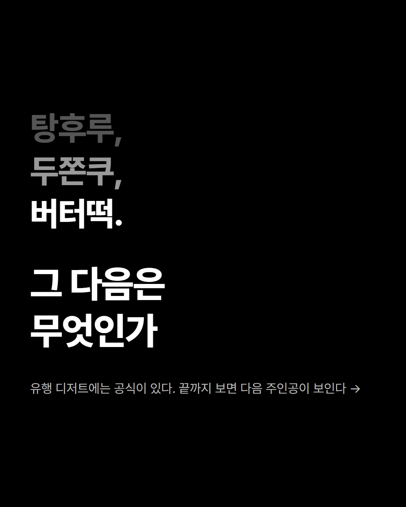
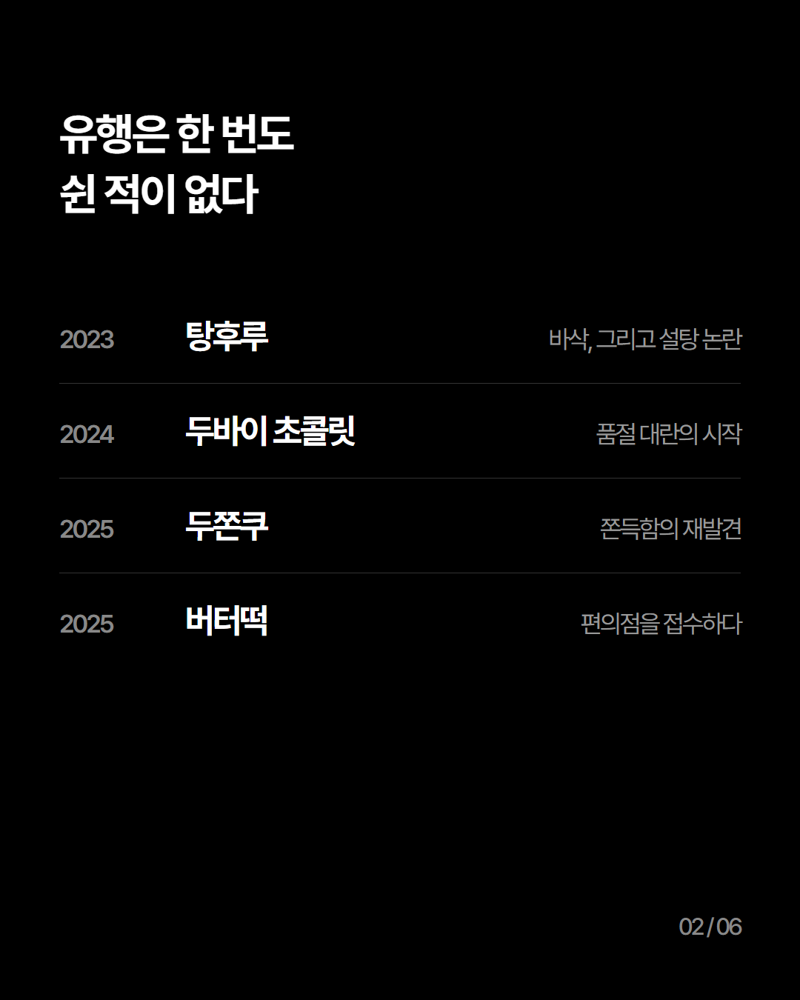
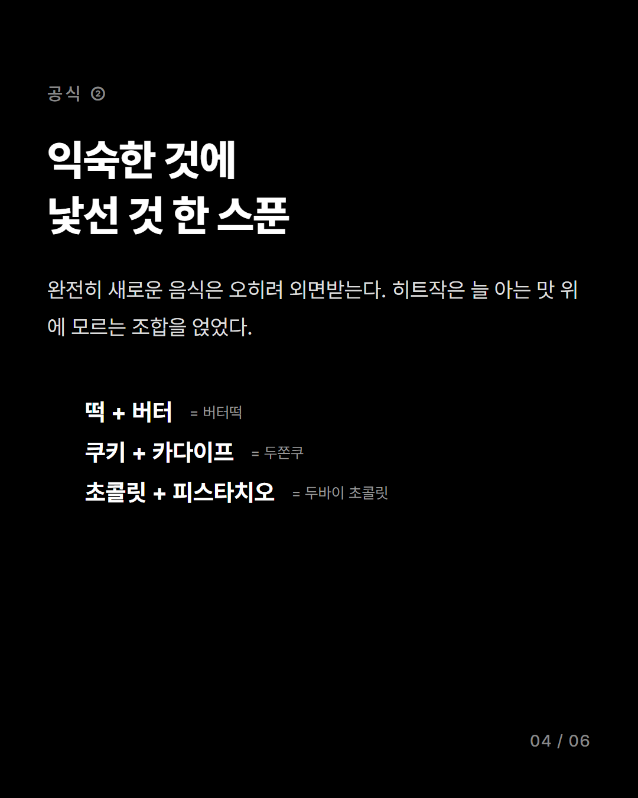
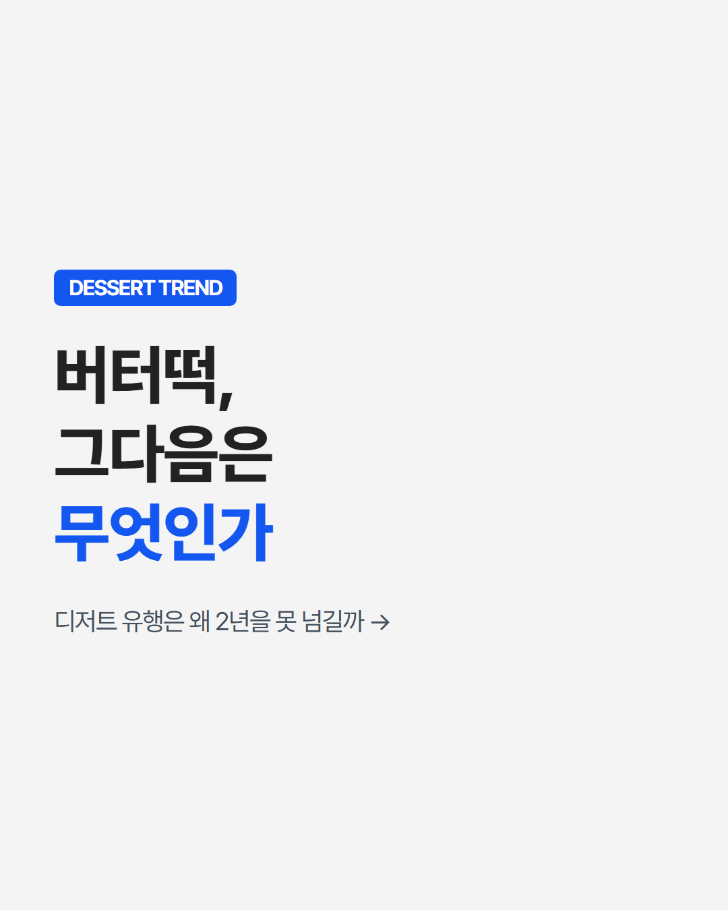
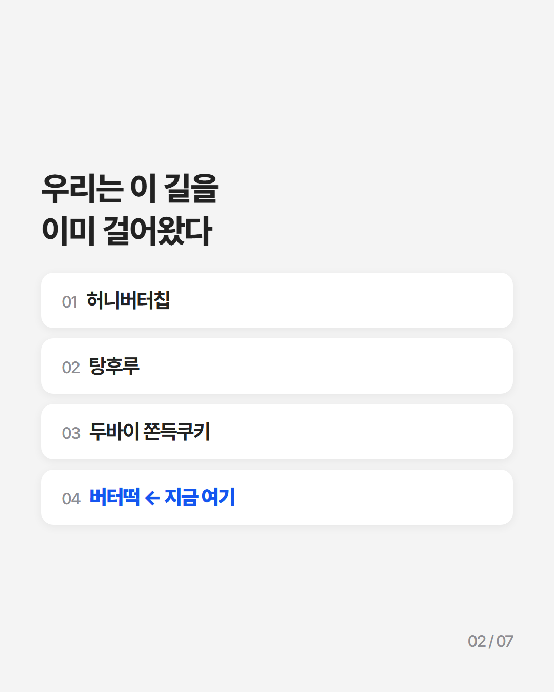
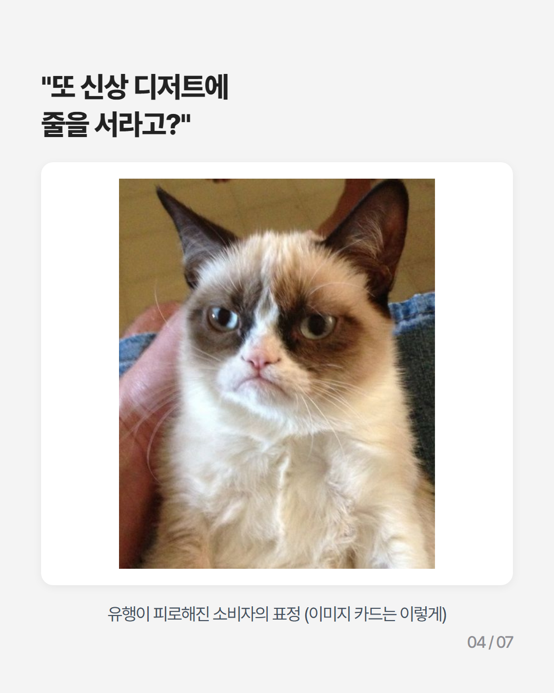
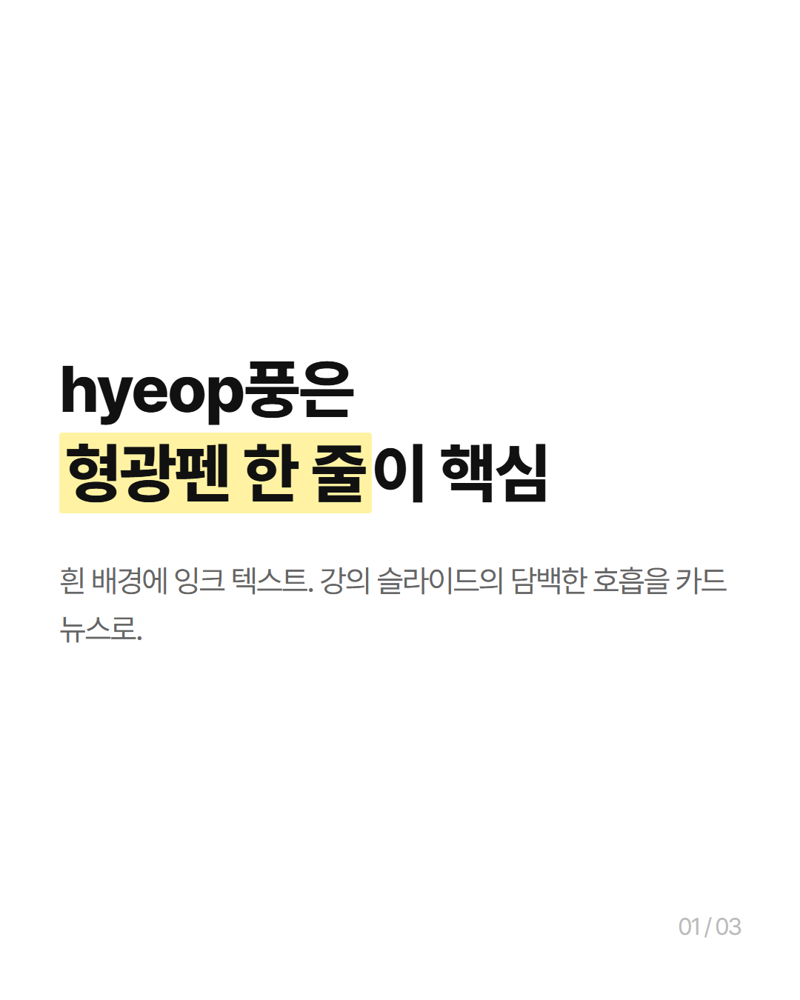
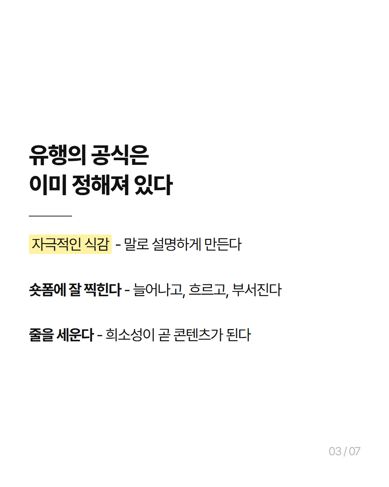
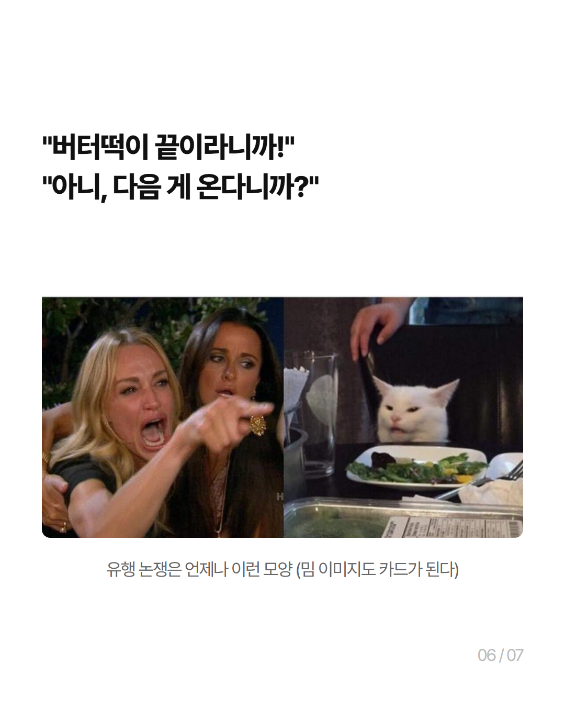

# card-news-simple-skill (카드뉴스 Generator)

주제 한 줄(또는 원고)을 주면 인스타용 **4:5 카드뉴스 이미지(1080x1350 PNG) 5~7장**을 만들어 주는 Claude Code 프로젝트.

## 샘플 갤러리

같은 주제도 디자인 프리셋에 따라 이렇게 달라집니다. (전체 장은 `output/` 폴더에)

**mono** - 검정 배경 흑백 타이포 (기본)

  

**paperlogy풍** - 회색 배경 + 흰 카드 + 포인트 블루

  

**hyeop풍** - 흰 배경 + 형광펜

  

## 이것만 하시면 됩니다
1. 이 폴더에서 Claude Code를 연다
2. Claude에게: **"○○ 주제로 카드뉴스 만들어줘"** (이미 쓴 글이 있으면 글을 통째로 줘도 됩니다)
3. 톤을 물어보면 답한다 (차분한 설명체 / 훅 중심 / 감성 에세이 등)

→ `output/주제폴더/` 안에 `01.png ~ NN.png`가 생깁니다. 그대로 인스타에 올리면 끝.

처음 쓸 때는 Claude가 몇 가지를 물어봅니다(닮고 싶은 스타일, 자주 쓸 톤, 계정 표기 등). 답하면 그대로 기억하고 맞춰 갑니다.

## 바꾸고 싶으면
- **문구 수정** — "3번 카드 제목 ○○로 바꿔줘" (HTML이 남아 있어서 해당 장만 다시 뽑힙니다)
- **디자인 스타일** — 세 가지 프리셋이 있습니다: 검정 배경 흑백 타이포(기본) / 회색 배경 + 흰 카드 + 포인트 블루 / 흰 배경 + 형광펜. 뭐가 좋을지 모르겠으면 "세 방향으로 한번 뽑아볼까요?"라고 Claude가 시안을 비교해 줍니다. 세부도 말하면 같이 고쳐 갑니다
- **닮고 싶은 카드뉴스가 있으면** — 캡처를 `references/`에 넣고 "이 스타일 참고해줘". 채널 URL을 줘도 됩니다 - 게시물 5개 정도를 모아 와서 디자인뿐 아니라 어투·문장 길이·톤앤매너까지 분석해 맞춰 갑니다

쓰다가 결과가 충분히 마음에 들면, Claude가 "이 스킬을 뭐라고 기억할까요?"라고 물어보고 당신만의 스킬로 분화시켜 줍니다.

## 원칙
원고를 주는 경우, 내용·사실·수치는 건드리지 않고 카드 단위로 나누고 압축만 합니다. 없는 얘기를 지어내지 않습니다.

## 크레딧 · 출처
- **만든 곳** — AI 네이티브 https://ai-native.kr · 오픈카톡 https://open.kakao.com/o/gAqUef1e
- **제작 과정 기록** — `prompt_log.txt` (이 프로젝트를 만들 때 실제로 입력한 프롬프트와 인터뷰 답변 전체)
- **Disclaimer** — 여기서 나오는 카드뉴스의 퀄리티 자체는 아직 엉망입니다. 이 프로젝트의 목적은 완성된 디자인 템플릿이 아니라, **"카드뉴스 생성 파이프라인 하나가 어떻게 만들어질 수 있는지"를 보여주는 예제**입니다. `prompt_log.txt`를 보면서 본인 취향의 파이프라인으로 직접 길들여 가시는 걸 권합니다.
